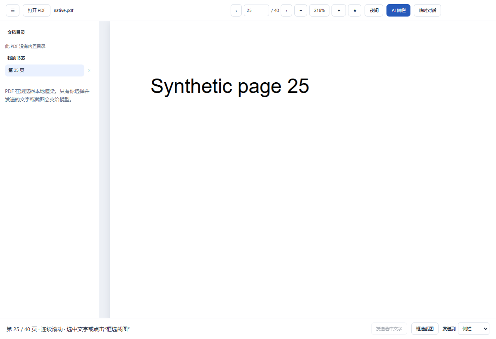
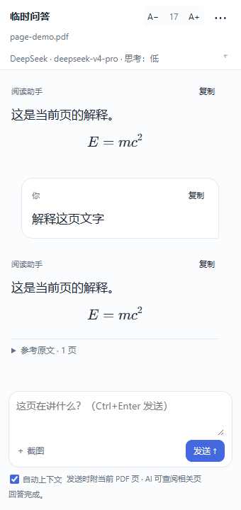

# PDF Copilot · PDF 阅读助手

本仓库同时提供 **开智 0.2.0 Windows 桌面版**，支持 PDF / Markdown 文档库、多文件标签、AI 阅读助手，以及可自定义底板的玻璃界面。[下载开智桌面版](https://github.com/graohene10-spec/pdf-copilot/releases/tag/desktop-v0.2.0) · [桌面版使用与构建说明](desktop/README.md)。桌面源码位于 `desktop/`，复用本仓库的阅读与 AI 公共模块；桌面与浏览器插件分别使用独立版本号。

轻量的 Windows Edge / Chrome 扩展，把 AI 对话放在 PDF 阅读旁边。继续使用浏览器自带阅读器，也可以切换到基于 PDF.js 的增强阅读器，连续滚动、选文、框选公式，并让 AI 按需查阅相关页。

**当前版本：v0.3.3。** 使用 DeepSeek / OpenAI API Key，只需安装扩展；复用 Codex CLI 登录，再安装随包提供的 Windows 小助手。默认版自带公式排版模块和字体，无需安装 LaTeX。

[下载 v0.3.3](https://github.com/graohene10-spec/pdf-copilot/releases/tag/v0.3.3) · [完整安装与使用教程](docs/USER_GUIDE.md) · [本版更新](docs/RELEASE_NOTES_v0.3.3.md) · [隐私与权限](PRIVACY.md)

当前开发版新增增强模式框选快捷键、切换标签页后继续接收回复，以及多个窗口共用的并发限制与等待队列。这些新增功能尚未包含在上面的 v0.3.3 发行包中；本地从源码构建可使用。

## 第一次安装：从这里开始

需要 Windows，以及基于 Chromium 132 或更新版本的 Edge / Chrome。当前采用手动加载扩展的方式，尚未上架浏览器商店；普通用户使用安装包无需 Node.js、Python、.NET SDK 或 TeX。

1. 打开 [v0.3.3 下载页](https://github.com/graohene10-spec/pdf-copilot/releases/tag/v0.3.3)，展开 **Assets**，下载 **pdf-copilot-0.3.3.zip**。不要下载页面底部自动生成的 Source code 归档。
2. 右键 ZIP → **全部解压**，放在准备长期保留的目录，例如 `C:\Tools\PDF-Copilot`。解压后应看到 `extension`、`windows-helper`、`docs` 等文件夹。
3. 在浏览器地址栏输入 `edge://extensions`（Edge）或 `chrome://extensions`（Chrome），按回车。
4. 开启 **开发人员模式**，点击 **加载解压缩的扩展**（Chrome 也可能显示“加载已解压的扩展程序”），选择解压后的 **extension 文件夹**。这个文件夹应直接包含 `manifest.json`；不要选 ZIP 或外层目录。
5. 在浏览器工具栏的扩展菜单中固定 PDF Copilot 图标。点击图标打开侧栏，再点顶部 **⋯ → 模型与密钥设置**；设置页应显示 **v0.3.3**。
6. 选择一种模型连接方式。**API Key 用户**：选择服务商，填写 API Key，保留默认 API 地址，选择账户可用的模型与思考强度，点击 **保存设置**，允许浏览器请求的 API 网站权限。**Codex 用户**：先按[教程中的 Codex 步骤](docs/USER_GUIDE.md#方式-bcodex-本机登录)安装 CLI、登录和小助手，再在设置中检查连接、读取模型并保存。
7. 推荐先从侧栏 **⋯ → 增强阅读器** 打开阅读页，点击 **打开 PDF** 选择一个本地文件。这条路径不需要“允许访问文件网址”。顶部显示页码、正文出现，即表示文件已打开。
8. 点击阅读器顶部 **AI 侧栏**，保持输入框下方 **自动上下文** 勾选，输入“用中文解释当前页的主要内容”，点击 **发送 ↑**。无需先截图。应先出现等待提示，再收到回答；支持图片的模型会收到当前 PDF 页图。

**安装后请保留加载的 extension 文件夹。** 浏览器持续从该目录读取插件文件。遇到问题，可按[逐步教程](docs/USER_GUIDE.md)核对每一步和成功提示。

## 能做什么

| 功能 | 浏览器自带 PDF 阅读器 | 增强阅读器 |
|---|---|---|
| 阅读与导航 | 保留浏览器原有界面 | 连续滚动、页码输入、目录、内部链接、个人书签 |
| 缩放与夜间显示 | 由浏览器提供 | 放大、缩小、适合宽度、夜间模式 |
| 直接提问当前页 | 自动附当前标签页可见区域 | 自动附当前 PDF 页图；文字模型改读当前页文字 |
| 发送文字 | 复制粘贴；右键选文菜单视浏览器支持情况而定 | 页内选文后点击“发送选文” |
| 框选公式或图表 | 截取可见标签页，在截图窗口裁剪 | 点击“框选截图”或按可自定义的 Alt + Shift + S，直接在单页内拖动 |
| AI 按需补充上下文 | 使用提供的文字或截图 | 查目录、搜索术语/公式编号、读取相关段落，图片模型可核对页图 |
| 原文引用 | 保留来源信息 | 显示物理页码/文档页标签，可回跳并高亮来源 |
| 对话入口 | 侧栏与快捷键临时问答 | 侧栏、临时问答按钮；可选择附件发送目标 |

对话支持 DeepSeek API、OpenAI API 和 Codex 本机登录，模型与思考强度可调整，回复流式显示，可停止、复制、清空会话。顶部 **A− / A+** 将字号调整为 14–24，默认 17；点击数字恢复默认。文字、代码和公式同步缩放，字号在侧栏和临时窗口间同步。

开发版中，侧栏随当前标签页显示该页的独立会话，原页继续接收回复，切回可查看结果；草稿和附件也分别保留。默认全部窗口同时运行 **2 题**，其中 Codex 最多 **1 题**，最多等待 **8 题**，在 **模型与密钥设置 → 多标签页与排队** 中调整。按最早可运行的提问顺序分配空位，Codex 满额时不会挡住有空位的 API 提问；等待中的问题可以停止，队列满时保留问题与附件。关闭对话界面或原 PDF 标签页、更换原文档会停止对应提问。

**自动上下文默认开启**，保留用户主动关闭的偏好。只有点击发送才会准备页面并调用模型；翻页本身不会上传。没有手动附件时附当前页，有选文或截图时使用附件，避免重复附整页。自动页图默认收起，可展开预览。增强模式还可按需补充其他页的相关内容，整份 PDF 不自动上传。

按需页图默认上限为 **每题 5 次**（包括自动附上的当前页）。在 **模型与密钥设置 → PDF 资源限制** 中可调整页图次数、证据页数、正文字符数、读取次数、API 检索轮次、搜索扫描页数和时间，支持恢复默认。保存后从下一题生效。具体范围及安装升级要求见[资源限制教程](docs/RESOURCE_LIMITS.md)。

例如：“式 (6.23) 的符号在哪里定义？结合前面的假设解释这一步。”AI 可以检索当前文档，再给出带来源的解读。扫描件没有文字层时无法全文搜索；复杂公式和图表建议使用支持图片输入的模型。

## 下载文件怎么选

在 [v0.3.3 Release 的 Assets](https://github.com/graohene10-spec/pdf-copilot/releases/tag/v0.3.3) 选择一种完整包即可：

| 文件 | 内容 / 用途 |
|---|---|
| **pdf-copilot-0.3.3.zip** | **推荐**：扩展、内置公式模块、可选 Windows 小助手、教程与许可 |
| pdf-copilot-lite-0.3.3.zip | 极简完整包，公式显示原文；其他功能相同 |
| pdf-copilot-extension-0.3.3.zip | 仅自带公式的扩展；加载解压后直接包含 manifest.json 的目录 |
| pdf-copilot-extension-lite-0.3.3.zip | 仅极简扩展 |
| pdf-copilot-windows-helper-0.3.3.zip | 单独更新 Codex 小助手，解压后双击 install.cmd |
| pdf-copilot-source-0.3.3.zip | 供开发者构建的源码，不能直接加载为完整扩展 |
| SHA256SUMS.txt / DISTRIBUTIONS.md | ZIP 校验和与两版体积对照 |

默认完整包约 **3.3 MiB**，极简完整包约 **2.9 MiB**，具体见附带的对照表。两版使用同一扩展 ID，选择一版安装。默认版不从 CDN 获取公式字体；API 模型仍需要网络和相应账户权限。

## 模型连接要点

- **DeepSeek / OpenAI API**：默认 API 地址分别为 `https://api.deepseek.com`、`https://api.openai.com/v1`。只填写基础地址，不追加 `/chat/completions` 或 `/responses`。模型预设不保证账户可调用，可自行输入模型 ID。API Key 默认仅保留到浏览器关闭；“记住密钥”使用扩展本地存储。具体步骤见[API 配置教程](docs/USER_GUIDE.md#方式-adeepseek--openai-api-key)。
- **Codex**：使用同一 Windows 用户下的 Windows 原生 CLI，需要 0.159.2 或更新版本；完整 PDF 动态工具往返已在 0.160.0 验证。先安装 CLI、运行 `codex login`，再双击 `windows-helper/install.cmd`，在设置中 **检查连接并读取模型**。不需要填写 API Key。具体安装命令与排障见[Codex 教程](docs/USER_GUIDE.md#方式-bcodex-本机登录)。
- 已有 ChatGPT 浏览器登录不会自动变成 OpenAI API Key。Codex 路径使用 CLI 自身认证；设置页显示实际程序、版本及登录结果。可用模型、额度和图片能力由服务和账户决定。

## 快捷键与本地文件权限

| 操作 | 建议默认快捷键 |
|---|---|
| 打开 AI 侧栏 | Ctrl + Shift + 7 |
| 打开增强阅读器 | Ctrl + Shift + 8 |
| 临时问答 | Alt + Shift + Q |
| 框选截图（增强模式直接框选） | Alt + Shift + S |
| 发送问题（对话输入框内） | Ctrl + Enter |

以设置页显示的实际快捷键为准。如果“未设置”或发生冲突，点击 **设置浏览器快捷键**，在 `edge://extensions/shortcuts` / `chrome://extensions/shortcuts` 中分配，再点击 **重新检查**。

对浏览器已经打开的 `file:///` PDF 截图，需要在扩展详情启用 **允许访问文件网址**。从该标签页切入增强阅读器时，还需点击阅读页的 **授权本地文件读取并打开 PDF**，补齐本地读取授权。也可以直接在增强阅读器点击 **打开 PDF** 选择文件，跳过这两项网址读取授权。在线 PDF 首次打开会按网站申请读取权限；一次性或登录下载地址失败时，下载文件后用文件选择器打开。

## 从上一发行版升级

1. 下载并解压本版完整包，关闭旧阅读器、侧栏和临时窗口。
2. 将新 **extension 文件夹的内容**覆盖到原加载目录，在浏览器扩展管理页点击 **重新加载**。不要移除原扩展再安装，以便保留设置和书签。
3. **使用 Codex 的用户**运行本版 **windows-helper/install.cmd** 更新助手；只使用 API Key 的用户跳过。
4. 重开设置页确认 **v0.3.3**，再打开 PDF。需要自动提供当前页时，确认 **自动上下文** 已勾选。

[详细更新说明](docs/UPDATING.md) · [常见问题与逐步排障](docs/USER_GUIDE.md#常见问题按提示排查)

## 数据与资源

PDF 在浏览器本地解析，搜索索引、自动页图和裁剪过程保留在内存。点击发送后，问题、当前附件/当前页及有限文字历史交给所选模型服务；历史图片不自动重发。不同文档分别保存有限内存会话，临时窗口独立，关闭释放。个人书签只保存文档指纹和页码。

默认版复用 PDF.js 和 KaTeX，没有前端框架、开发者后台或常驻服务。增强阅读器最多保留 3 个页面画布，合计约 1600 万像素；本地文件上限 256 MiB。每题按需提供的证据有页数、文字、图片与调用次数上限，长文档检索可能只覆盖部分范围。应用不主动保存截图文件，浏览器/操作系统行为和服务端政策不在此保证内。[隐私与权限细节](PRIVACY.md)

## 验证范围

94 项单元检查通过，1 项真实元数据检查默认跳过；默认/极简版各 6 组资源配置检查通过，另有 6 组上下文回归通过。此前公开版的自动当前页、滚动/框选/公式/字号、24 组功能验收及本地 URL 检查保留为回归基础。浏览器检查使用合成 PDF、隔离 Edge 配置与本机模拟模型；此前 Codex 的真实工具往返另使用过少量合成证据。

DeepSeek / OpenAI API 真实推理、全新电脑安装卸载、不同系统的真实快捷键及原生选文菜单尚未完整实测。当前没有商店签名或自动更新。详细范围见[测试记录](docs/QA_REPORT.md)与[验收清单](docs/ACCEPTANCE.md)。

## 开发者：从源码构建

使用发行安装包的用户可跳过。开发机需要 Node.js 22+；编译助手需 .NET Framework 4.x 编译器，不需 .NET SDK 或 NuGet。

~~~powershell
npm ci --ignore-scripts
npm run build
npm run build:lite
npm run build:host
npm run check
npm run check:lite
npm test
npm run package
~~~

加载 `dist/extension` 或 `dist/extension-lite`；安装包输出到 `release/0.3.3`。浏览器验收需另外安装 Playwright，不进入发行包，执行方式见[开发验收说明](docs/ACCEPTANCE.md)。

[架构说明](docs/ARCHITECTURE.md) · [小助手协议](docs/native-host.md) · [发布流程](docs/RELEASING.md)

## 许可

本项目采用 [MIT](LICENSE)。PDF.js、KaTeX 等第三方许可见 [THIRD_PARTY_NOTICES.md](THIRD_PARTY_NOTICES.md)。
